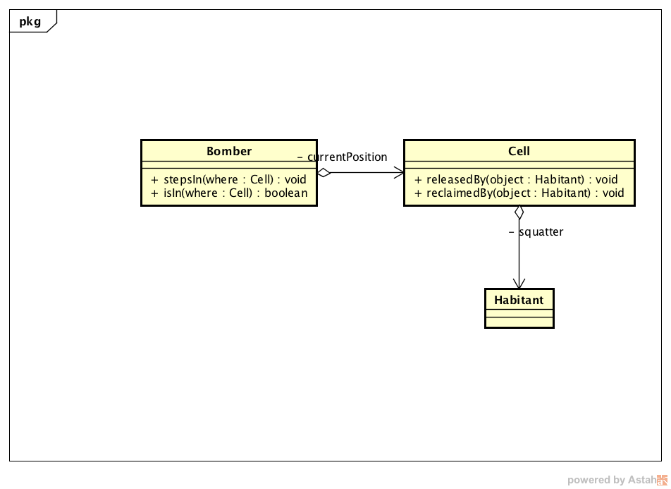

# Dojo#3

Participantes

| Nombre y Apellido | Actividad |
| ----------------- |:---------:|
| David Machado     | Codeo     |
| Pablo Lucadeli    | "         |
| Lucia Garbarini   | "         |
| Juan Ucciani      | "         |
| Fede Bazán        | "         |
| Gisela Saborido   | Oyente    |

## Qué hicimos durante el dojo?

Abordamos el ejercicio [Dojo#3](https://github.com/diegosanchez/dojo/tree/workshop/dojo_3) codificando solo los dos primeros tests y comenzamos a pensar el 3re test.

## Qué ideas surgieron durante y/o problemas el dojo?

1. Checked - Agregar un método al ```Bomber>>getCurrentPosition```
2. Checked - Utilizamos TDD para discribir el modo de utilización de la/s clase/s de nuestro modelo.
3. Checked - Tengo que establecer una herencia para que la celda contenga cualquier cosa (bomber, ladrillos, etc.)
4. Checked - Reporte de cobertura.
5. Checked - Enriquecer interfase vs Getters y Setters

## Cronología de la actividad

Comenzamos escribiendo el código **MÍNIMO** necesario para que nuestro primer tests pase poniendo especial atención y cuidado en el código que escribímos ya que este será la interface de las entidades de nuestro modelo. A modo de referencia listo el caso de uso que vamos a implementar.

```js
    it("steps into a cell which is empty then it moves in", () => { 
        // Whatever code attendes wrote
    });
```

Fué en este punto que notamos que TDD nos permitía diseñar la solución entendiendo por diseño: definir conjunto de entiedades y sus interfaces (Cuestion 3). Vale la pena recordar como es el flujo de [TDD](../dojo_2/NOTES.md). 

Lo primero que hicimos fué escribir las entidades, sus relaciones e interfases de forma tal que:
- El código se lea como una historia.
- El código sea fácil de utilizar.
- El código cumpla con ciertos critérios de diseño (S.O.L.I.D).
- Las interfaces sean coherentes con los objetos que las esgrimen (Responsabilidades Coherentes para cada una de las Entidades)

```js
    it("steps into a cell which is empty then it moves in", () => { 
        var bomber = new Bomber();
        var where = new Cell();
        bomber.stepIn( where );
        bomber.getCurrentPosition() == where
    });
```

Vemos en este código que estábamos exponiendo innecesariamente la propiedad posición del ```Bomber```. Esto viola el principio de ocultamiento de la información.  Entonces que hichimos...??? Lo siguiente:

```js
    it("steps into a cell which is empty then it moves in", () => { 
        var bomber = new Bomber();
        var where = new Cell();
        bomber.stepIn( where );
        bomber.isIn(where)
    });
```

Varias cuestions a considerar...

### Rol que desempeñamos en la escritura del código del test

Es importante notar que al momento de escribir los tests de integración estamos encarnando el rol del usuario de nuestra API y es deseable intentar utilizar las clases (bajo construcción) como si no supiéramos **como** es que llevan a cabo la tarea que estamos describiendo.

### Cantidad de decisiones transcendentes que tomamos y legibilidad 

Habiendo planteado la última descripción de nuestro test (la que incluye ```Bomber.isIn```) hemos enriquecido las interfaces de nuestras entidades evitando revelar estado propio de cada uno da ellas. Esto tiene un impacto directo en la reducción del acoplamiento y el consecuente aumento de la cohesión (Cuestión 5).

### Ocultamiento de la información

Habiendo evitado la utilización del método ```Bomber>>getCurrentPosition``` mantenemos este detalle de implementación oculto para el/los clientes de nuestra API con sus consecuentes ventajas: Facilidad de uso de la API y reducción del acoplamiento (Cuestion 1).

### Enriquecimiento de interfases de entidades

El enrequecimiento de las interfases trae aparejado la distribución de responsabilidades.  En este punto, hasta el momento, el ```Bomber``` tiene las siguientes responsabilidades (derivadas de su interfase):

- Dar un paso a otra celda -> ```Bomber>>stepsIn```.
- Saber donde está -> ```Bomber>>isIn```.


Finalmente, habiendo escrito nuestro tests podemos ya pasar a escribir el código **MÍNIMO** necesario para que este test pase.

> Evitar la tentación de modificar el test para que la programación de nuestro código se más sencilla. Recordar que el test es lo que debe ser y tenemos que apegarnos a esto.

Con el test escrito y el código correspondiente obtuvimos el siguiente diagrama de clases:



De haber intentado resolver el segundo test de integración 

```js
it("steps into a cell which is busy with an object then it doesn't move and throw an exception", () => {
    var bornPlace = new Cell();
    var bomber = new Bomber( bornPlace );
    var here = new Cell( new Something() );
    chai.assert.throws( () => {
        bomber.stepsIn( here );
    });
});

```

Surgió la necesitad para ```Bomber``` de interactuar con la ```Celda```.  Cómo? Definiendo una interfase coherente y legible para la celda. Esta interfase es la que se describe en el diagrama de clases.  

De el diagrama de clases surge (nuevamente) la necesidad de generar una abstracción (```Habitant```) para que la celda contenga varios tipos de cosas.  Esto nos remitió a una [discución que habíamos tenido en dojos anteriors](https://github.com/diegosanchez/dojo/blob/workshop/dojo_2/NOTES_2.md#lenguajes-tipados-y-no-tipados) (Cuestion 3).

La interacción que se estableció entre ```Bomber``` y ```Celda``` queda descripta por el siguiente diagrama de secuencia:


Habiendo diseñado nuestra solución utilizando TDD y escribiendo el código MÍNIMO necesario para que nuestors tests pasen obtuvimos el siguiente porcentaje de cobertura (Cuestión 4):


### To be continued...
