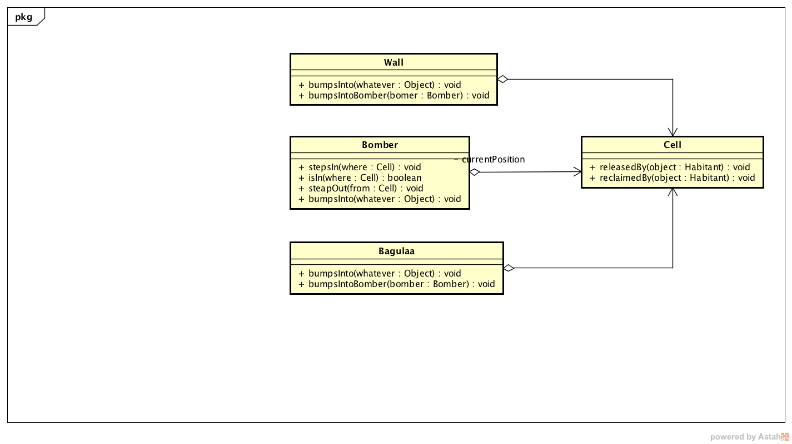
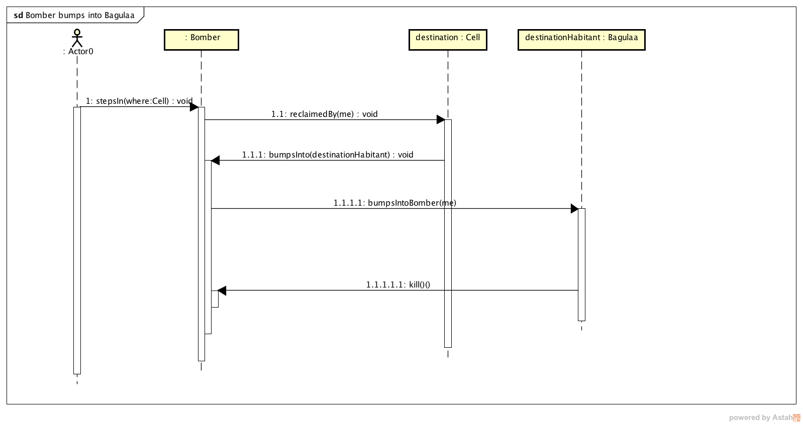

# Dojo#3

Participantes (*omitido intencionalmente*)

## Qué hicimos durante el dojo?

Abordamos el ejercicio [Dojo#3](https://github.com/diegosanchez/dojo/tree/workshop/dojo_3) implementando el segundo y tercer tests lo que nos forzó a realizar un refactor de nuestro modelo.

## Qué ideas surgieron durante y/o problemas el dojo?

1. Checked - null vs Entidades
2. Checked - Interacción entre entidades y extensibilidad 

## Cronología de la actividad

Retomamos la actividad habiendo codificado el test: 

```js
it("steps into a cell which is busy with an object then it doesn't move and throw an exception", () => {
    var bomber = new Bomber(new Cell());
    var there = new Cell(new Wall());

    chai.assert.throws(() => { bomber.stepsIn( there ) }, Error);
});
```

Dado que estábamos aplicando TDD, antes de proseguir con el siguiente test ```it.skip("steps into a cell which is busy with an enemy then it dies", () => {}); ```, analizamos la necesidad de un refactor (no necesariamente debemos llevarlo acabo). Para enmarcar las consideraciones comparto el código actual:

```js
var Bomber = class Bomber {

    constructor(initialPosition){
        initialPosition.reclaimedBy(this);
        this.currentPosition = initialPosition;
        this.alive = true;
    }

    stepsIn(newPosition) {
        newPosition.reclaimedBy(this);
        this.stepsOut(this.initialPosition);
        this.currentPosition = newPosition;
    }

    stepsOut(position) {
        position.release();
    }

    isIn(position) {
        return this.currentPosition.isEqual(position);
    }
};
```

No vimos necesidad de modificar el código del ```Bomber``` ya que:
- El código hace referencia a entidades del negocio.
- Los mensajes a los objetos son coherentes con su responsabilidad.
- No hay ifs (je!)
- Observación esta linea de código es extraña ```this.stepsOut(this.initialPosition);```. Quedaría más legible escribiendo ```this.stepsOut(this.currentPosition);```, no?

Seguimos revisando nuestro código y llegamos a la clase ```Cell``` (listo a continuación):

```js 
var Cell = class Cell {

    constructor(okupa) {
        this.okupa = okupa;
    };

    reclaimedBy(reclaimer) {
        if(this.okupa) {
           reclaimer.bumpsInto(this.okupa);   
        } else {
            this.okupa = reclaimer;
        }
    }

    release() {
        this.okupa = undefined;
    }
};
```

Dos cosas llaman la atención aquí:
- Aparece un ```if``` en el método ```reclaimedBy```. Uff! 
- Qué es ```okupa```?  

El nombre ```okupa``` no es representativo para nuestro modelo de entidades, entonces tenemos que cambiarlo.  Podríamos utilizar *inhabitant*, *dweller*, *occupant* o *resident*.
Este ```if``` es consecuencia directa de que la celda tiene un ocupante que puede existir o no.  Este código evidencia la carencia de una entidad en nuestro modelo que represente la ausencia de contenido u ocupante.  Esta carencia en el diseño trae aparejadas varias consecuencias que no se evidencian sino hasta la implementación de las sucesivas pruebas (Cuestion 1).

> La utilización del ```null``` o el ```undefined``` evidencia la ausencia de una entidad del negocio que represente la ausencia de contenido. Esto tiene como efecto la necesidad de tomar desiciones (es null o no el habitante) en lugar de delegar responsabilidad a la instancia que ocupa la celda (**cualquiera sea su clase**).

En este punto preferimos **ignorar** este hecho y continuamos escribiendo el siguiente test.  *No olvidemos esta observación porque va a tener implicancias en breve!*

Implementamos el siguiente caso de uso de la siguiente manera:

```js
it("steps into a cell which is busy with an enemy then it dies", () => {
    var bomber = new Bomber(new Cell());
            
    var there = new Cell();
    var bagulaa = new Bagulaa(there);
    
    bomber.stepsIn(there);
    chai.assert.equal(bomber.isDead(), true);
    chai.assert.equal(bomber.isAlive(), false);
});
```

Para involucrar este nuevo requerimiento sufren modificaciones tanto ```Cell``` como ```Bomber```, listo y comento:

```js
var Cell = class Cell {

    constructor(okupa) {
        this.okupa = okupa;
    };

    reclaimedBy(reclaimer) {
        if(this.okupa instanceof Wall) {
            // Wall vs reclaimer interaction
            // might throw exception
            // There is not changes in cell 
        } else if(this.okupa instanceof Wall) {
            // Bagula vs reclaimer interaction
            // If reclaimer is Bomber Bagula must kill it.
            // There is changes in cell 
        } else {
            this.okupa = reclaimer;
        }
    }

    release() {
        this.okupa = undefined;
    }
};
```

Upa! Ahora se complicó feo el código! El ```if``` que comenzó como un elemento inofensivo hoy nos está afectando la legibilidad y extensibilidad del código.  En este punto imagino várias interacciones entre varias entidades: (Bagula - Bomber) (Bagula - Bomba) ( Bomba - Bomberman).

Es increíble ver **como nos afecta** la ausencia de la entidad que representa el contenido vacio de la celda (está íntimamente relacionado con este código de baja calidad).

### Descartando los ifs

Definamos la entidad ```Emtpy``` que será el contenido por defecto de una celda. Entonces el código de la celda quedaría de la siguiente manera.

```js
var Cell = class Cell {

    constructor(okupa) {
        this.okupa = okupa || new Empty()
    };
```

Esto nos permite **NO** tener que consultar si el ocupante de la celda es ```null```. Y de que me sirve esto??! 

> Independientemente de quién sea el ocupante y quién sea el reclamador de la celda podemos decirles a ambos que colisionen (bumpsInto) entre sí! Que ellos se encarguen de interactuar (vía polimorfísmo).

```js
var Cell = class Cell {

    constructor(okupa) {
        this.okupa = okupa || new Empty()
    };
    reclaimedBy(reclaimer) {
        // The interaction returns the winner of the battle
        this.okupa = reclaimer.bumpsInto(this.okupa);
    }

    release() {
        this.okupa = undefined;
    }
};
```

Para cada una de las entidades que colisionan vamos a tener que definer este método ( ```Wall```, ```Bomber```, ```Bagula``` y ```Emtpy```).  El más interesante es el siguiente:

```js 
var Bomber = class Bomber {

    // ...
    // ...
    // ...

    bumpsInto(objectOrEnemy) {
        objectOrEnemy.bumpsIntoBomber(this);
    }

    // ...
    // ...
    // ...

};
```

En el caso particular que el Bomberman colisione con la pared la paré implementará ```Wall>>bumpsIntoBomber``` en cuyo caso lanzará una excepción. El código nos queda:

```js

var Wall = class Wall {
    bumpsIntoWithBomber(bomber) {
        throw new Error("Aca nOO");
    }
};
```

En el caso particular que el Bomberman colisione con ```Bagula``` este implementará ```Bagula>>bumpsIntoBomber``` en cuyo caso ```Bagular``` mata a ```Bomber```:

```js
var Bagulaa = class Bagulaa {

    // ...
    // ...

    bumpsIntoBomber(bomber) {
        bomber.kill();
    }

    // ...
    // ...
};
```

Y mágia! Desaparecen los ifs! Lo que estamos aplicando aquí es un patrón de disño llamdado [Dobule dispatch](https://en.wikipedia.org/wiki/Double_dispatch)

> Notar la importancia de definir **TODAS** las entidades de negocio y el impacto que esto genera en el código que se genera. Las entidades son capaces de adoptar nuevos comportamientos mientras que los tipos de datos ```null``` o ```undefined``` no!


> Habiendo seguido la metodología TDD logramos implementar estos casos de prueba obteniendo una cobertura del % 100

Muestro como quedó nuestro diagra de clases hasta el momento: 



Muestro diagrama de secuencia de colisión enter ```Bagulaa``` y ```BomberMan```: 



Muestro diagrama de secuencia de colisión enter ```Wall``` y ```BomberMan```: 


### To be continued...
